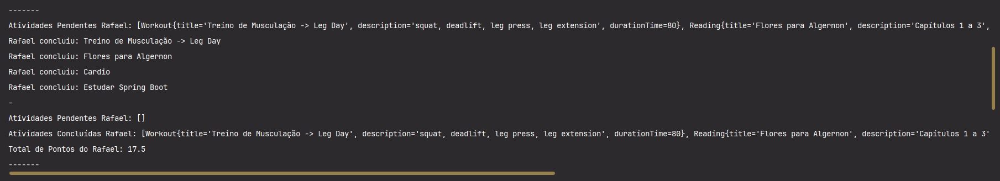

 

  
  

<h1 align="center">📝 To-Do List com POO em Java 📝</h1>

  Um projeto para colocar em prática os 4 pilares da Programação Orientada a Objetos, adaptando um desafio da <strong><a href="https://web.digitalinnovation.one/">Digital Innovation One</a></strong> para um contexto de lista de tarefas pessoal.

  <a href="#-sobre-o-desafio">Sobre</a> •
  <a href="#-minha-adaptação">Adaptação</a> •
  <a href="#-demonstração">Demonstração</a> •
  <a href="#-tecnologias">Tecnologias</a> •
  <a href="#-contribuindo">Contribuindo</a> •
  <a href="#-autor">Autor</a>

## 🌟 Sobre o Desafio 

O desafio original da DIO, **"Aprenda na Prática Programação Orientada a Objetos"**, teve como objetivo principal a aplicação dos quatro pilares da POO em Java: ***Abstração, Encapsulamento, Herança e Polimorfismo***. O cenário proposto envolvia a modelagem de um ecossistema de Bootcamps e Devs, permitindo praticar esses conceitos essenciais.

> 🔗 Você pode conferir o repositório do desafio original [aqui](https://github.com/cami-la/desafio-poo-dio).

## 💡 Minha Adaptação: Sistema de To-Do List Pessoal 

Para aprofundar meu entendimento e aplicar os conceitos de POO em um contexto diferente, adaptei a estrutura do desafio para um **Sistema de Gerenciamento de To-Do List Pessoal**. A ideia foi transformar o domínio de "Bootcamps e Devs" em "Agendas e Usuários", onde cada usuário pode organizar e concluir diferentes tipos de atividades, acumulando pontos.

### 🎯 Objetivo da Adaptação

O principal objetivo foi demonstrar como os mesmos princípios de POO podem ser aplicados a um problema distinto, validando o entendimento sobre:

-   **Abstração:** Generalizar diferentes tipos de atividades (`Workout`, `Reading`, `Study`).
-   **Encapsulamento:** Proteger os dados internos das atividades e dos usuários.
-   **Herança:** Criar tipos específicos de atividades a partir de uma base comum (`Task`).
-   **Polimorfismo:** Tratar diferentes atividades de forma unificada, mas com cálculos de pontos específicos para cada uma.

### 🗺️ Mapeamento de Classes

A mesma lógica do desafio original foi mantida, apenas renomeando e adaptando as responsabilidades para o novo domínio:

| Classe Original (DIO) | Nova Classe (To-Do List) | Descrição da Adaptação |
| :--- | :--- | :--- |
| `Conteudo` (abstrata) | `Task` (abstrata) | Classe base para qualquer item da lista. `XP_PADRAO` virou `DEFAULT_PT`. |
| `Curso` | `Workout` | Atividades de treino. `cargaHoraria` virou `durationTime`. |
| `Mentoria` | `Reading` | Atividades de leitura. `data` foi adaptado para `numPages`. |
| *(Nova Classe)* | `Study` | Nova classe para estudos, com pontuação baseada em `studyHours`. |
| `Bootcamp` | `Notebook` | Agrupa um conjunto de `Tasks` para serem associadas a um `User`. |
| `Dev` | `User` | A entidade que gerencia sua lista e calcula o total de pontos. |

## 📸 Demonstração 

*Print do terminal executando o `Main`*

## 🛠️ Tecnologias 

-   **Linguagem:** `Java 11`
-   **IDE:** `IntelliJ IDEA`
-   **Controle de Versão:** `Git` e `GitHub`

## 🤝 Contribuindo 

Este repositório foi criado para fins de estudo, mas sinta-se à vontade para contribuir!

Se te ajudei de alguma forma, ficarei feliz em saber. E caso você conheça alguém que se identifique com o conteúdo, não deixe de compartilhar. 😊

-   ⭐ Dê uma **Star** no projeto
-   🐛 Encontre e relate **Issues**

---

  Desenvolvido com ❤️ por <a href="https://github.com/sybzinha">sybzinha</a>

